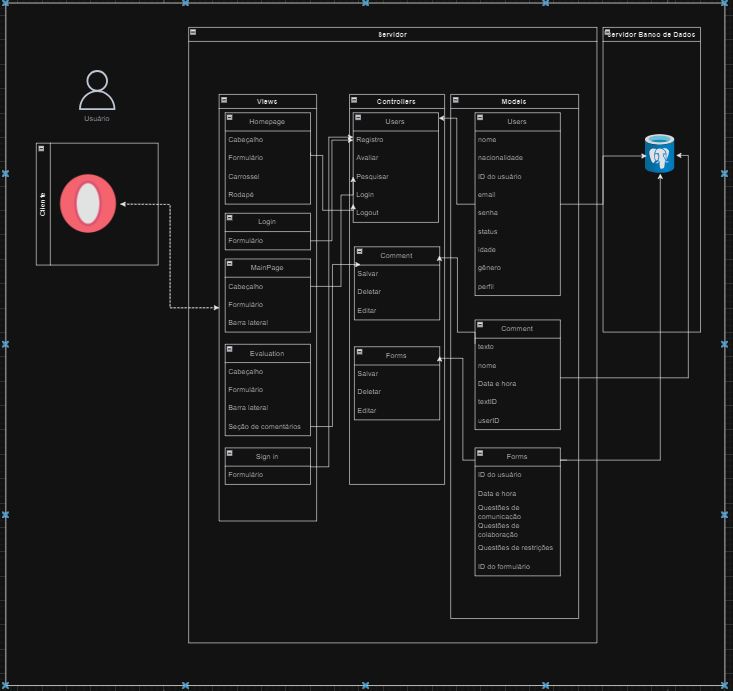

# Exemplo de Design de Arquitetura

Figura 1 - Arquitetura MVC
 

 
Fonte: Elaborado pelo autor (2024).

Link da arquitetura: (https://drive.google.com/file/d/1fLqUtimuWpyWXXxYRZ2jUsy_U9Iru6pO/view?usp=sharing)

- Nome do Projeto: TechFlex
- Descrição: Arquitetura MVC do projeto para a faculdade ZUYD, apresentando as funcionalidades do trabalho
- Arquitetura: MVC (Model-View-Controller)
- Ferramenta de Diagramação: https://app.diagrams.net

# Documentação da Arquitetura MVC

## Visão Geral
A arquitetura MVC é um padrão de design que é utilizado para separar a lógica de negócios, a lógica de apresentação e a interação do usuário. No nosso projeto, ao acessar o site, as views são o ponto de entrada, apresentando a interface com a qual o usuário vê e interage. As ações realizadas nas views são passadas para os "Controladores", que manipulam os dados através dos "Modelos". Tanto as "Visões", quanto os "Controladores" e "Modelos" estão em um no servidor, enquanto um servidor de banco de dados separado gerencia as informações.

## Estrutura da Aplicação

### Views
- **Homepage**: A tela inicial exibindo `Cabeçalho`, `Formulário`, `Carrossel` e `Rodapé`.
- **Login**: Tela de login que contém um `Formulário` para autenticação do usuário.
- **MainPage**: A tela principal após o login, apresentando `Cabeçalho`, `Formulário` e `Barra lateral`.
- **Evaluation**: Página de avaliações com `Cabeçalho`, `Formulário`, `Barra lateral` e `seção de Comentários`.
- **Sign in**: Tela para novo cadastro de usuário com um `Formulário` específico.

#### Componentes do views
- **Cabeçalho**: Elemento no topo da página com logotipo e navegação.
- **Barra lateral**: Barra lateral com links de navegação.
- **Rodapé**: Rodapé com informações adicionais e links.
- **Formulário**: Campos para entrada de dados do usuário.
- **Carrossel**: Componente para passar por diferentes conteúdos, como imagens.

### Controllers
- **Users**: Trata das operações dos usuários, incluindo `Registro`, `Avaliar`, `Pesquisar`, `Login` e `Logout`.
- **Comment**: Responsável por `Salvar`, `Deletar` e `Editar` comentários.
- **Forms**: Lida com `Salvar`, `Deletar`e `Editar` os dados dos formulários.

### Models
- **Users**: Representa a estrutura de dados dos usuários, incluindo campos como `nome`, `nacionalidade`, `ID do usuário`, `email`, `senha`, `status`, `idade`, `gênero` e `Perfil`.
- **Comment**: Contém dados de comentários como `texto`, `nome`, `data e hora`, `ID do texto` e `ID do usuário`.
- **Forms**: Armazena dados dos formulários, incluindo `ID do usuário`, `data e hora`, `Questões de comunicação`, `Questões de colaboração`, `Questões de restriçõs` e `ID do formulário`.

## Fluxo de Interação
O fluxo de interação entre as partes da arquitetura segue da seguinte forma:
1. O usuário interage com o view ao preencher um formulário.
2. O view envia essa ação para o controller.
3. O controller processa a ação e interage com o model.
4. O model pode alterar ou recuperar dados do banco de dados.
5. Os resultados são passados de volta ao controller.
6. O controller atualiza a view com as novas informações.
7. O usuário vê o resultado da sua interação na view.

## Infraestrutura
Os controllers e views são hospedados em um servidor, enquanto um servidor de banco de dados separado mantém os model. Como consequência, é possível ter gerenciamento eficiente dos componentes da arquitetura.

#### Implicações da Arquitetura:
A arquitetura MVC foi escolhida para o projeto pelas suas vantagens em escalabilidade e manutenção, permitindo que diferentes componentes sejam atualizados com facilidade. A estrutura facilita a testabilidade, permitindo testes eficientes. Além disso, promove um desenvolvimento ágil, acelerando o ciclo de lançamentos e adaptações do produto às necessidades do cliente.

